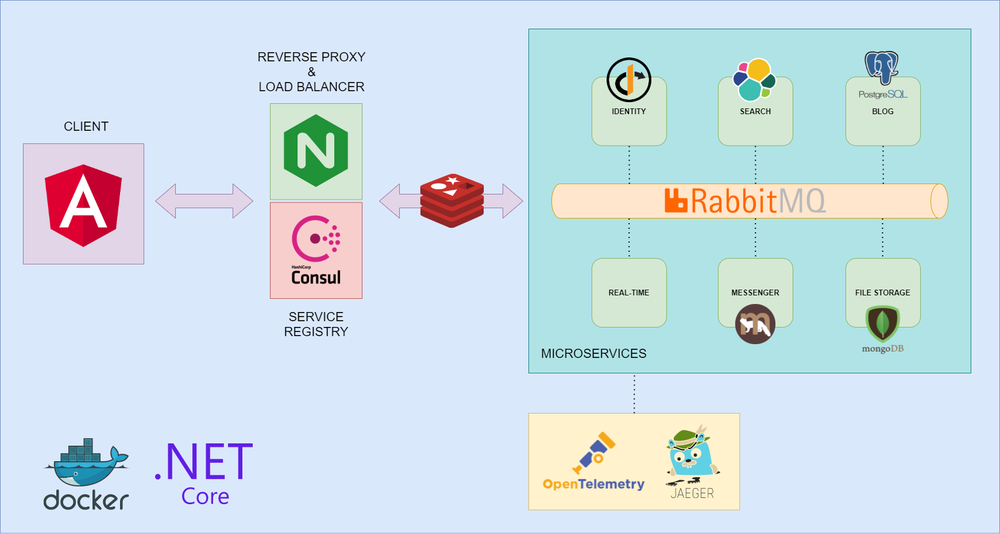

## ProjectX  

This is an application of moderate complexity built using .NET and designed for the cloud and using as a playground for experimentation. It is heavily centered around the Microsoft .NET technology stacks as these are what I have the most experience in & just like building things with. 😀

### Why is this here? 

This is where I mess around with code. I wanted something to try new things out on, without the risk of substantially endangering an actual production environment used by actual people. It was for this reason that I built the ProjectX app as a way to test out tools, libraries, patterns, frameworks & various other stuff. This application is also used as a reference for configuring/wiring up some common things I sometimes forget how to do. Living Documentation if you will. So this repo hopefully may contain something for everyone, fill in the potential gaps across the whole spectrum of application development. It falls somewhere between a template/boilerplate project, a real-world production open-source application.  

 It is heavily inspired by the .NET Microservices: Architecture for Containerized .NET Applications book, as well as its companion reference application eShopOnContainers. It also incorporates various elements from different repos, blog posts which served as inspiration.  

It is built using Clean Architecture principles with CQRS (Command Query Responsibility Segregation), DDD (Domain-Driven Design), and Event-Driven Architecture. It doesn't follow these principles to the letter, but provides a decent example of how to apply the basics of these principles.  

The application's functionality is broken up into many distinct microservices. Each of these separate services has its own persistent storage. Asynchronous communication between the services is done by using a message bus (RabbitMq).

### Technology stack:

  - .NET Core
  - PostgreSQL
  - Entity Framework
  - Marten (Event store)
  - Identity Server 4
  - RabbitMq
  - Redis
  - Docker Compose
  - NGINX (Reverse proxy)
  - MediatR

### Patterns/Architecture:

  - Microservices
  - CQRS
  - Event Sourcing 
  - Domain-Driven Design
  - Unit of Work (ACID), Generic Repository
  - Event-Driven Architecture (Domain Events, Integration Events, Outbox/Inbox)
  - REST
